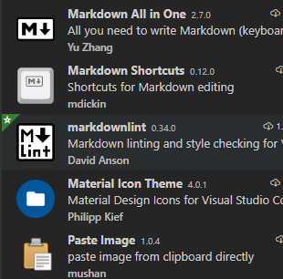

## `markdown`语法规则

习惯了无`GUI`的终端开发模式，键盘输入`md`标记符号肯定是首选。

习惯了`window`界面化操作的朋友，推荐`vscode`快捷键的模式进行`md`标记符号的插入。

有人要吐槽了，怎么能懒成这样？理由很简单：

- `md`在于抛弃文章的样式
- **符号标记**实现各种样式的渲染

靠脑子记住和直接使用快捷键，这个问题不用过多纠结，取决于个人喜好。

## 环境

前两年也许还有人推荐`sublime`，有篇老的博文，那会我介绍的还是`sublime`。

现在都已经**2020**年了，`vscode`一统江湖，千秋万代。

本地的轻量编辑，首选`vscode`。捎带一提，国内部分云厂商的云上开发环境，`IDE`核心也是使用的`vscode`。

背后靠着微软爸爸，加上开源界的推动，`vscode`用起来是真香。

## 插件

具体的插件说明，自行阅读插件说明，毕竟我能提供的只是当前的版本，直接阅读插件说明，肯定是没错的。

`Paste Image`，配合`hugo`的图片插件方式，能快捷的实现本地图片的引用。

## hugo

前文也提过，本人是从`hexo`切换到了`hugo`。

1. `hugo`支持在单独的文件夹放置图片和`md`文档
2. `academic`主题在设计上支持多种各式的文章样式

- 随笔
- 演讲
- 电子书

## academic

官网默认`exampleSite`，`menu`路径都是组件的方式`#组件`，其实我更推荐使用`url`方式。

`url`的模式，点击导航栏能实现单页的跳转，而非在首页进行滚动。

## 结尾

小朋友又要吐槽了。我是来学习从零搭建个人博客，你怎么从头到尾都说的模模糊糊，细节什么的都不提。

我想说的是，目前使用的这些工具：

- **官方手册**
- **插件说明**
- **各式博文介绍**

快速上手新技术，推荐先阅读官网文档，**粗读**不求一遍看懂，至少心里有个数。

和看书的道理一样，先看目录，搞清楚作者准备讲什么。

## 彩蛋

切换`hugo academic`内置风格样式，发布到站点，访问时，风格没有发生变换。

聪明的小伙伴已经想到了，清空本地浏览器缓存，能解决问题。

机智的我：`F12`开发者模式，切换到`network`，勾选`disable cache`，刷新，搞定！

