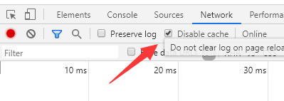

## `markdown`语法规则

如果你习惯了`Linux`那种纯命令行输入的方式，记忆几组格式化的命令符不是难事。我就比较懒了，基本都是靠`vscode`快捷键。

有人可能要吐槽我了，怎么能懒成这样？理由其实很简单：

- `md`在于抛弃文章的样式
- **符号标记**实现各种样式的渲染

靠脑子记住和直接使用快捷键，这个问题不用过多纠结，看个人喜好即可。

## 环境

前两年也许还有人推荐`sublime`，有篇老的博文，那会我介绍的还是`sublime`，现在都已经**2020**年了，`vscode`一统江湖，千秋万代。

本地的轻量编辑，首选`vscode`。捎带一提，华为云设计的云上开发环境，`IDE`核心也是使用的`vscode`。

背后靠着微软爸爸，加上开源界的推动，`vscode`用起来是真香。

## 插件

快捷键这款，强烈推荐，用习惯以后，大幅提高文字的输出效率。

`Paste Image`，配合`hugo`的图片插件方式，能快捷的实现本地图片的引用。

提到图片的插入，就不得不提当初为什么做了博客系统的切换，`hexo`设计之初应该就没考虑图片的插入，后续随给了补救的方式，但是对于我这种只是写写博客，截图也是偶尔来那么几张的人来说，显得不是那么友好。

## hugo

前文也提过，本人是从`hexo`切换到了`hugo`。

1. `hugo`支持在单独的文件夹放置图片和`md`文档
2. `academic`主题在设计上支持多种各式的文章样式

## academic

官网给的`exampleSite`，`menu`路径都是组件的方式，其实我更推荐使用`url`方式。这样点击菜单就能实现单页的跳转，而不是首页点击多次才能进入详情页面。

## 结尾

看到这里，有的小朋友可能又要吐槽了。我是来学习从零开始搭建个人博客的，你怎么从头到尾都说的那么模模糊糊，细节什么的都不提。

我想说的是，目前使用的这些，都有

- **官方手册**
- **插件说明**
- **各式博文介绍**

对于新技术的使用我，我推荐的做法还是先阅读官网的文档，先做一次简单的尝试，东西先用起来，用多了就自然熟悉了。

## 彩蛋

在切换了`hugo academic`内置的风格样式，且正常发布，访问站点时，风格可能没有发生变换。

聪明的小伙伴已经想到了，清空本地浏览器缓存，能解决问题。

机智的我：`F12`进入开发者模式，切换到`network`，勾选`disable cache`，刷新，搞定！

