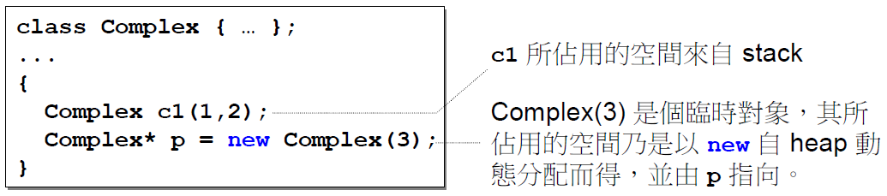
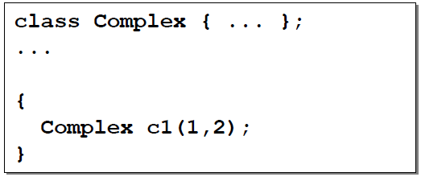
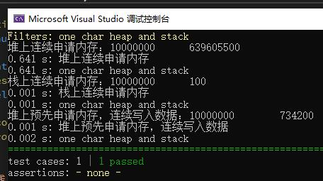
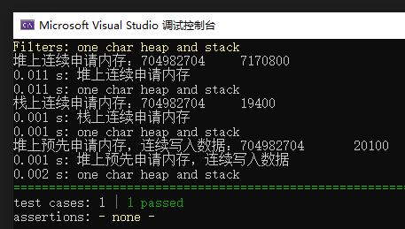

上一篇中我还特意提到了编译器的选择， 实际上本专栏正式开始前，有一篇关于编译器的介绍，这可真是目录都没看，就开始"翻书"了。

前面也提到了，目录都没细看，直接开始听稿子，没想到第一讲说的居然是堆、栈。

 - 堆：`heap`，在内存管理中，指的是动态分配的内存，`new delete malloc free`。也叫做`system heap`，是指由操作系统提供的一块`global`內存空間，程序可动态分配(`dynamic allocated`) 从某中获得若干区塊(`blocks`)。
 - 栈：`stack`，函数调用过程中的本地变量和调用数据的区域。是存在于某作用域(scope) 的一块内存空间(`memory space`)。例如当你调用函数，函数本身即会形成一个`stack`用來放置它所接收的参数，以及返回地址。在函数本体(`function body`) 內声明的任何变量，其所使用的內存块都取自上述`stack`。



`RAII`在我看来属于`C++`的内存管理方式，配合析构函数，对象对于外部而言并没有直接内存相关的操作。

最新正好在开发一个和行情相关的项目，为了提高性能，能说一句恰逢其时？`C11`的智能指针效率，**存在纳秒级别的性能损耗**。

### 堆

```
auto ptr = new std::vector<int>();
```

动态申请内存时(堆)，三个常见的内存操作：
- 让内存管理器分配一个某个大小的内存
- 让内存管理器释放一个之前分配的内存块
- 让内存管理器进行垃圾回收，寻找不再使用的内存块并进行释放

**由于动态分配内存存在不确定性**，在特定的场合，会禁用动态分配：飞行控制器和电信设备

`C++`通常做前面两步，`java`通常做1和3。不同的语言有着不同的实现方式。

释放内存不只是简单地把内存标记为已未使用。对于连续使用的内存块，通常内存管理器需要将其合并成一块，一遍满足后续大的内存分配申请。
**目前的编程模式都要求申请的内存块是连续的**。

### 栈

- 栈上的分配极为简单，移动一下栈指针
- 栈上的释放也简单，函数执行结束是，移动一下栈指针即可
- 由于后劲先出的执行过程，不可能出现内存碎片

`c1`便是所谓`stack object`，其生命在作用域(`scope`) 结束之际結束。这种作用域內的`object`，又称为`auto object`，因为它会被「**自动**」清理。



### 实践

其实我相信，就算读完了上面这些内容，对于堆栈的含义理解的也不会那么深刻，最大的疑问就是，我知道哪些是堆哪些是栈，对于实际的程序开发有什么意义？
先给结论：
1. **动态向操作系统申请内存的耗时，远远大于已经申请的内存区域写入数据**
2. **直接操作栈内存的耗时基本基本等于像已经申请的内存块写入数据**

概述起来就是一句话，程序运行期间，向操作系统申请内存，在纳秒级别时，属于昂贵的操作，开发高性能的程序，需要预先申请所需要的内存。

- 测试环境：visual studio 2019
- CPU：i7-6700 3.41GHz

案例的含义在于分别统计：连续申请堆内存并操作，预先申请堆内存并操作，连续操作栈内存



```
{
	int result = 0;

	SECTION("堆上连续申请内存")
	{
		auto timer = std::chrono::steady_clock::now().time_since_epoch().count();
		for (auto i = 0; i < kTestCount; i++)
		{
			int* j = new int(1);
			result += *j;
			delete j;
		}
		auto count = std::chrono::steady_clock::now().time_since_epoch().count() - timer;
		std::cout << "堆上连续申请内存：" << result << "\t" << count << std::endl;
	}

    SECTION("栈上连续申请内存")
    {
        auto timer = std::chrono::steady_clock::now().time_since_epoch().count();
        for (auto i = 0; i < kTestCount; i++)
        {
			int j = 1;
			result += j;
        }
        auto count = std::chrono::steady_clock::now().time_since_epoch().count() - timer;
		std::cout << "栈上连续申请内存：" << result << "\t" << count << std::endl;
    }

    SECTION("堆上预先申请内存，连续写入数据")
    {
        auto timer = std::chrono::steady_clock::now().time_since_epoch().count();
		int* j = new int(1);
        for (auto i = 0; i < kTestCount; i++)
        {
			*j = 1;
            result += *j;
        }
		delete j;
        auto count = std::chrono::steady_clock::now().time_since_epoch().count() - timer;
        std::cout << "堆上预先申请内存，连续写入数据：" << result << "\t" << count << std::endl;
    }
}
```

其实呢，初次看到上面的测试案例结果，肯定会纳闷，怎么预先申请的内存和栈内存的性能差别那么大，其实这个属于现在编译器`Release`模式的代码优化。
每次操作的都是常数，编译器就能预先做掉一部分事情，具体原理本人不是很清楚，不过我们改进一下测试案例，每次累加动态的数据。



```
{
	int result = 0;

	SECTION("堆上连续申请内存")
	{
		auto timer = std::chrono::steady_clock::now().time_since_epoch().count();
		for (auto i = 0; i < 100000; i++)
		{
			int* j = new int(i);
			result += *j;
			delete j;
		}
		auto count = std::chrono::steady_clock::now().time_since_epoch().count() - timer;
		std::cout << "堆上连续申请内存：" << result << "\t" << count << std::endl;
	}

    SECTION("栈上连续申请内存")
    {
        auto timer = std::chrono::steady_clock::now().time_since_epoch().count();
        for (auto i = 0; i < 100000; i++)
        {
			int j = i;
			result += j;
        }
        auto count = std::chrono::steady_clock::now().time_since_epoch().count() - timer;
		std::cout << "栈上连续申请内存：" << result << "\t" << count << std::endl;
    }

    SECTION("堆上预先申请内存，连续写入数据")
    {
        auto timer = std::chrono::steady_clock::now().time_since_epoch().count();
		int* j = new int(1);
        for (auto i = 0; i < 100000; i++)
        {
			*j = i;
            result += *j;
        }
		delete j;
        auto count = std::chrono::steady_clock::now().time_since_epoch().count() - timer;
        std::cout << "堆上预先申请内存，连续写入数据：" << result << "\t" << count << std::endl;
    }
}
```

# 引用

本文为课程笔记：[https://time.geekbang.org/column/article/169225](https://time.geekbang.org/column/article/169225)

参考博客：[https://www.cnblogs.com/kelamoyujuzhen/p/10452929.html](https://www.cnblogs.com/kelamoyujuzhen/p/10452929.html)