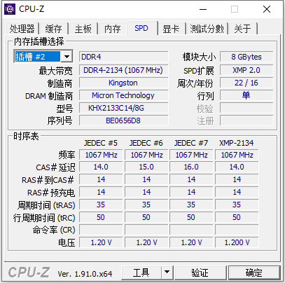
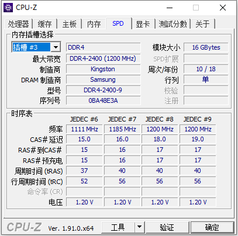
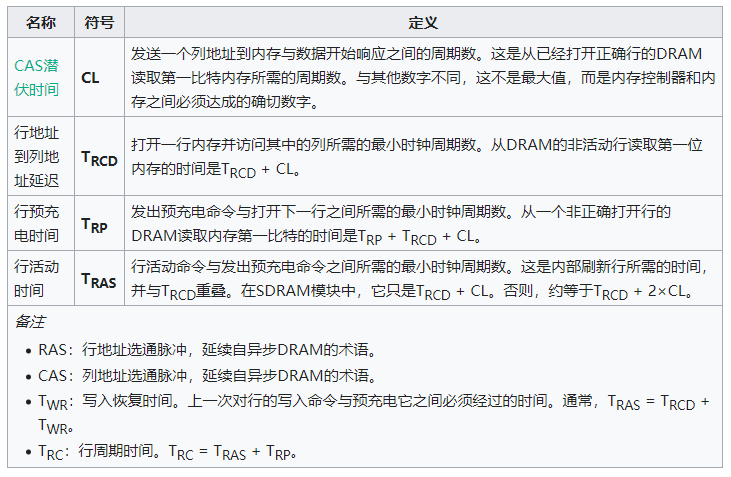

### 缘·妙不可言

打小呢就想着组装一台自己的电脑，奈何经济条件不允许。好不容易熬到了大学，为了便于携带，配置的也是笔记本。如果非要有个具体的时间点，我是什么时候开始有组装电脑这个念想的，就要说到老家的图书馆。毕竟也是个市区级别的图书馆，不仅有电子阅览室（其实从没去过，据说是按时计费），还有个杂志阅览室，也就是在这里，翻阅到了《大众软件》、《电脑报》这类杂志，对接触电脑不多的我来说，堪称神级科普资料。看到打副本的章节，就想着自己弄个电脑，也去拉怪，当主力输出；看到黑科技呢，幻想自己照着书上的做，也能达到描述的效果（论黑客工具的使用）。虽说高中课业重，就我那会的认知，书要读，玩也要玩，过的也算是“天真烂漫”，打着去图书馆看书的由头，没事就拎着个小包溜达过去，市区不大，一般都是徒步走去图书馆。到了地，吹着空调，看着小说、漫画、游戏杂志，偶尔也看点正经的书籍。

年纪大了就容易忘事，图书馆引发的还不算是初次萌芽。初中的时候，亲戚家组装过一台电脑，也不知道当初组装那台机器是干嘛用的。操作系统还是 windows 2003，游戏有系统自带的纸牌 + 帝国时代。各种“斗智斗勇”想着偷到钥匙，带着堂弟一起玩游戏。

刚入初中，学校就有就计算机的初级培训，后来转学，也接触到了一点计算机竞赛的概念。等到了高中，NOIP混过一次。说道这里，就不得不提，校友的力量，高中的计算机大楼是校友捐赠的，包含计算机教学室+图书馆。其实那会也是国内互联网浪潮的初浪。校领导也支持参与计算机竞赛，毕竟前面两届的学长，好几位前辈通过计算机保送了重点大学。

> 从未这样回顾过我和电脑这些事。也难怪我毕业后硬是从自动化专业义无反顾的转到了计算机行业，种子早已种下，局中人不自知而已。从小接触的多了，以为自己很厉害，其实也就懂个皮毛，最大的优势也就是最初的那份热情。

### 硬件组装

多逛逛卡吧、chiphell、知乎电脑组装的板块，萌新能较为简单的给出一份自己需要的机器清单。2019年后选购CPU，经济条件不充裕的情况下，想要更高的性能，首选AMD。

推荐一个常用的硬件性能对比网站：[https://cpu.userbenchmark.com/](https://cpu.userbenchmark.com/)，价格这块基本可以和咸鱼的美版做个对比。真大佬可以去咸鱼淘二手的，能便宜很多。如果不是很精通，不推荐去咸鱼，本人就购买了假内存，虽说目前使用没发现问题，不太确定太多了，型号和参数完全对不上。

#### SN550 VS SN750

SN550 1TB容量和SN750 1TB容量差别就是，两者持续读写差一倍，一个850MB，一个1.6GB，但日常使用没区别，因为两者4K都一样。当然这里说的是1TB容量的SN550，500G和250G速度顺序读写更慢。其实我觉得只要不是不差钱的，日常使用买SN550就行，我没买这个最大原因不是因为它的顺序读写速度，而是它最大只有1TB容量，而SN750有2TB容量。对我来说，在不额外扩展的情况下，主板的M.2 Nvme接口比这些固态的差价更值钱

综合网友的结论，入手一块转接板，B150 主板也能支持 M2 接口的固态。

#### 内存频率

日常工作的角度出发，频率不会对性能产生太大的影响。

 

内存时序（英语：Memory timings或RAM timings）是描述同步动态随机存取存储器（SDRAM）性能的四个参数：CL、TRCD、TRP和TRAS，单位为时钟周期。它们通常被写为四个用破折号分隔开的数字，例如7-8-8-24。第四个参数（RAS）经常被省略，而有时还会加入第五个参数：Command rate（命令速率），通常为2T或1T，也写作2N、1N。这些参数指定了影响随机存取存储器速度的潜伏时间（延迟时间）。较低的数字通常意味着更快的性能。决定系统性能的最终元素是实际的延迟时间，通常以纳秒为单位。

当将内存时序转换为实际的延迟时，最重要的是注意它是以时钟周期为单位。如果不知道时钟周期的时间，就不可能了解一组数字是否比另一组数字更快。

举例来说，DDR3-2000内存的时钟频率是1000 MHz，其时钟周期为1 ns。基于这个1 ns的时钟，CL=7给出的绝对延迟为7 ns。而更快的DDR3-2666（时钟1333 MHz，每个周期0.75 ns）则可能用更大的CL=9，但产生的绝对延迟6.75 ns更短。

现代DIMM包括一个串行存在检测（SPD）ROM芯片，其中包含为自动配置推荐的内存时序。PC上的BIOS可能允许用户调整时序以提高性能（存在降低稳定性的风险），或在某些情况下增加稳定性（如使用建议的时序）。

注意：内存带宽是测量内存的吞吐量，并通常受到传输速率而非潜伏时间的限制。通过交错访问SDRAM的多个内部bank，有可能以峰值速率连续传输。可能以增加潜伏时间为代价来增加带宽。具体来说，每个新一代的DDR内存都有着较高的传输速率，但绝对延迟没有显著变化，尤其是市场上的第一批新一代产品，通常有着较上一代更长的延迟。

即便增加了内存延迟，增加内存带宽也可以改善多处理器或多个执行线程的计算机系统的性能。更高的带宽也将提升没有专用显存的集成显卡的性能。

### 参考资料

* [内存时序参数说明](https://zh.wikipedia.org/wiki/%E5%86%85%E5%AD%98%E6%97%B6%E5%BA%8F)