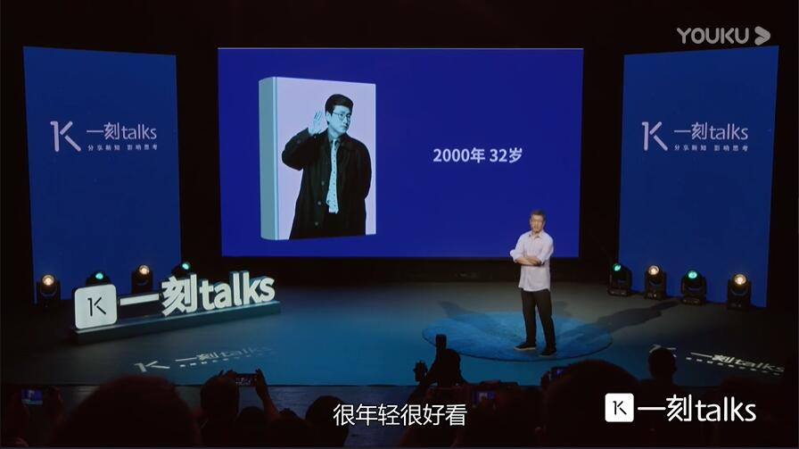
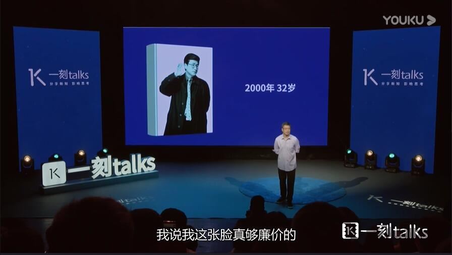
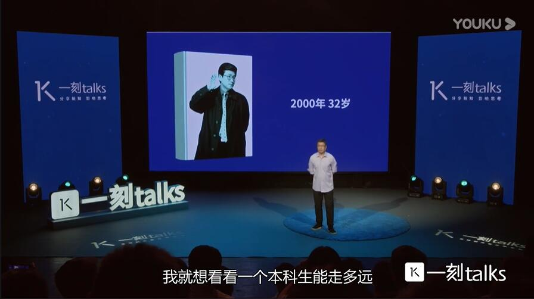
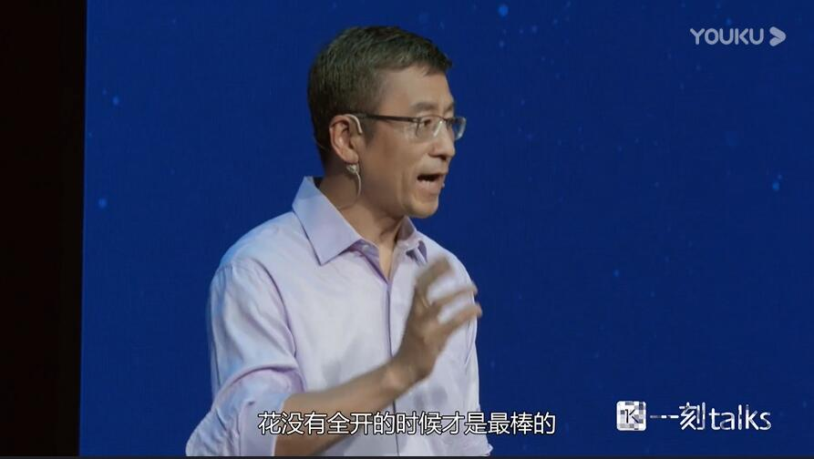
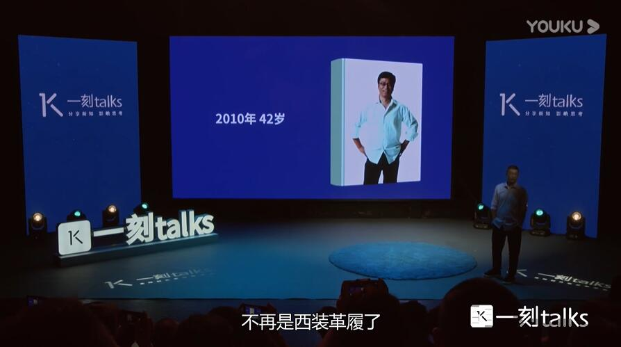
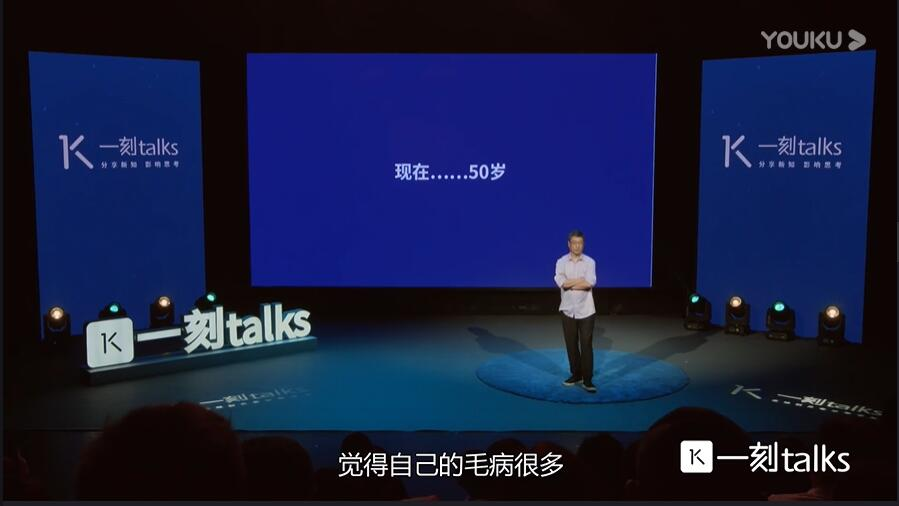

---
title: 关于光阴，你要读很多书才能找到答案
event: 岁月既慢且长，白说你听
event_url: 

summary: 
abstract: "今年我已经整整50岁了，30岁最大的人生感受是什么？回头看是减法。在30岁之前要玩命的做加法，要去尝试，40岁是困惑，不是不惑，这个时代40岁恐怕困惑的是最多的，我干的这一切有价值吗？有意义吗？我到底要什么物质没有给我带来，我以为会带给我的幸福，50岁很尴尬，你怎么去向前走就不该总是明天再说，或者昨天真好，我觉得今天最好，但是我督促自己，好奇是督促人类进步的最重要的一个动力。一个民族只要不好奇了，这个民族吹了，我也许做的不够好，但起码我在想、在做、在说。"

date: "2020-02-14T07:27:21+08:00"
date_end: "2020-02-14T07:27:21+08:00"
all_day: false

publishDate: "2020-02-14T07:27:21+08:00"

authors: 
- 白岩松
tags:
- 白岩松
- 白说
- 演讲稿
- 光阴

image:
  caption: 'Image credit: [**Unsplash**](https://v.youku.com/v_show/id_XNDI5MzA4NjcyNA)'
  focal_point: Right

--- 

今年我已经整整50岁了，过去没想过，我觉得这就是老头。现在才发现还真是老头，这是30岁时候的样子。30岁的时候不觉得自己很年轻，很好看，50岁的时候回头一看真不错，30岁最大的人生感受是什么？回头看。我觉得是减法，关键词就是减法。从某种角度来说，痛并快乐着也是一种减法，把很多东西经历的想过的写出去，然后留在那，去新的白纸上，去跑步了。但是对于我来说30岁我觉得的确无论是从自己还是对于各位的提醒来说，做减法都是非常重要的。 

我现在在带东西联大的学生，我经常提醒他们，在30岁之前要玩命的做加法，要去尝试，你不知道自己有多少种可能，你也不知道命运将会给你怎样的机缘。所以不是你怎么知道，但是有的人就在20多岁的时候拼命的事，各种加法，但是忘了收，忘了到一定的时候要做减法，我觉得30岁左右是人生非常重要的一个，要在做了一系列加法和四处乱跑之后，要做一次减法的重要时间，否则就晚了，为什么要做减法？你不是所有的都适合，也不是适合你的，所有的事，你都该去做。 

8条线拴着你，你能跑多远？可能会互相牵制。

在30岁的时候，我已经被破格提升，也就是说，学术的话叫教授，记者的话，叫高级记者。我29岁就被破格了，到现在这样的事情已经很少了，但是在那个时候又开始感到了一种巨大的困惑。到2000年的时候做悉尼奥运会，掌声也很多，我突然觉得一切都不太对劲了。我要自己问自己，你究竟要做什么？哪些东西是要抛掉的？那一年我做了非常重要的一个减法，我停了自己的节目，停了一年，没有任何出境，当时有人劝我说主持人这行，您只要一个月不出镜还凑合，您半年不出镜就没人记得你了，我说我这张脸真够廉价的。 

那一年开始去研发新节目。这是在出完了痛并快乐着之后，01年我整整停了一年。今天所走的一切其实都感慨于那个时候的做减法。我那个时候要问我可以做很多东西，我去做体育，我可以去做E了，可以去做很多其他好玩的东西，做制片人等等。但是我说不，我发现我只能做新闻，我也最该做新闻，在，然后我当时是三个栏目的制片人，我在一夜之间都辞了，也才成了今天的我。我单纯了。前几天跟同事聊天，我还说我说30来岁的时候做的一个非常重要的决定，不仅仅是很多可做的，但是我觉得我就是打新闻，这口深井，很多的职位有可能要提拔你当副主任了，我给拒绝了，回到了一个普通百姓的基础上。 

到现在为止，我是中央电视台连股级干部，都不是绝对本科毕业的群众。你了解我们的体制，但是我拒绝了。我就想看看一个本科生能走多远，一个本科生的学历，为什么不可以不断的去学习，让自己去带研究生吗？对，我现在带研究生，每年要带11个，这都是一个减法的结果。我觉得这当然是回过头来的一个感慨了。另外在年轻的时候，特别容易在奔波之中，最后就产生了一种感受什么呢？一切我都该得到，只要有哪个没得到，只要有哪件事有点缺陷，我就心里特别不舒服。 

在座的各位千万别也要学会做减法，就是在那个时候快到30岁的时候，28岁的时候，1996年看奥运会，我编出了一句话，**缺陷是完美的重要组成部分，这个世界上就没有完美**。在曾国藩的那部长篇小说里头，其实写到了一个很重要的一句话，人生的最好的境界是什么？曾国藩想给自己的书房起名叫求阙厅，花还没有全开的时候是最好的。月亮还没有全圆的时候是最好的，但是对于常人来说，都会觉得这是缺陷，还不够完美，不够达到极致，毁一个人的最好的方式就是让他求完美和达到极致。 

这个世界不是这样的，花没有全开的时候才是最棒的，花一全开，离落花就很近了，月亮一旦开始全圆，离慢慢的变成残月就很近了，所以我觉得这是我的30岁给我的很重要的一个助推和启示；40岁没那个时候好看了。但是我觉得放松了。自由一些了，为什么不再是西装革履了，不再是黑白模样了，而是开始问幸福了吗？

中国人有一句话叫40不惑，30岁是减法，40岁是困惑，不是不惑，我觉得现今这个时代40岁恐怕困惑的是最多的，我的中年危机来的还偏偏很早，到三十六七岁的时候就开始纠结，我干的这一切有价值吗？ 

有意义吗？我到底要什么幸福了吗？这本书就是在这个困惑的基础上诞生出来了，在30岁的时候你会发现你的很多幸福目标是与物质挂钩的，三十而立力指的是学历得立。你得有车有房，要不丈母娘都不打算把你媳妇许配给你，很物质，但是40不惑很难。我觉得古人可能是平均预期寿命比没现在长，因此它要浓缩40，他就不惑了，我觉得我40正困惑了，**物质没有给我带来，我以为会带给我的幸福**。同样在40岁的时候，之所以很多人问我，你幸福吗？ 

我那书名是幸福浪吗？是问号，代表的是我内心的困惑。中年危机的诞生，40岁你要去回答自己很多的问号，40岁左右要多跟自己聊聊天，要去读很多的东西，给自己一些答案。我很庆幸在我三十六七的时候走进了道德经的世界，我在《白说》里头已经谈到，在40岁的时候还要去思考的时候，如果周边的环境不发生改变，尤其是软环境，您心情舒畅的走出家门，到处是乱闯红绿灯的，你买个东西都是假的，打个疫苗。

我说这两天中国都在跟台风两个台风做斗争，一个台风是无形的，一个台风是有形的，无形的台风就是疫苗，它冲击的是我们内心安全的堤坝。 另一个台风，中国很少有从上海登陆的台风，这是题外话，接下来你就要去思考的是，你独善其身，你发生了很大的变化，你拥有了很多的答案，周围的环境不变化，你会幸福吗？**我有八个字说得比较重，我觉得我们现在是道德赤字人性亏损，这才是目前最大的赤字和最大的亏损**。前些天就在离这不远，我亲眼见到了两个车相撞，其实撞的没那么严重，该负责任的，因为他撞了另一个车，跟人家说咱停到路边，人家好也慢慢说准备停到路边了，前面的车撒丫子跑了，一车人也没有拦着他的。 

这会是一个负责任的父亲吗？这会是一个负责任的儿子吗？更不要说他怎么会是一个负责任的公民，而他可能是您的同事，这就是道德赤字和人性亏损也，必然会影响到你。你不管自己是多么一个大写的人，除非你足不出户，但问题是，足不出户也不妨碍您的孩子要打疫苗，您送外卖，那外卖也有可能有问题！

所以中国人如何学会由一个小老百姓变成一个公民，这可能是在我40岁的时候，既问给自己这个人，也问给社会的一个重要的命题。

如果说30岁是减法，40岁是困惑，我觉得50岁应该是我送给自己的词是好奇，50岁很尴尬，前不着村后不着店，进、可攻；退、要混，也可以。在自己取得的某种东西上躺10年，混到退休也似乎可以。 

最近看一本书，其中一本书上写得非常有意思，说在硅谷里真正成功的创业者，五六十岁的偏多，这跟我们的概念是不同的。中国如何什么时候能够不把创业全部当成年轻的事业，就跟中国不该把志愿者都当成青年志愿者一样。上一周我做了一期节目，是中国马上要招募退休的中小学教师，每年有二三万块钱的补助，然后去乡村当老师，而且必须是优秀的。我说这正是开启了退休后再就业的先河，当然不光是慈善了，但是回到50，离那块还有点距离，你怎么去向前走？ 

更重要的是对于50岁的人来说有两个挑战，第1个挑战是你自己，你是不是还对很多的事情好奇，你的人生观是如何的？我觉得我的50岁最大的收获，或者是我此时按照什么方式在活着，**我善待每一个今天，20岁的时候容易活在明天里，一不注意50岁容易活在昨天里，但是我努力的克制自己，既不活在明天，也不活在昨天，我善待每一个今天，50岁的人就不该总是明天再说，或者昨天真好！**

我觉得今天最好那天看蔡琴的演唱会碟，蔡琴说的一句话是蛮好的，他说每次看照片我都觉得两年前的我真好看，但是两年前的那一天，我从来没觉得自己好看过。这句话挺有味道的。我30岁的时候没觉得，那个时候我挺帅的，觉得自己的毛病很多，可是今天当我隔了20年回头看的时候。

原来我也年轻过，原来我头发那么多，所以善待你的每一个今天，两年后再看您的今天最好不过了。

>就像史铁生说的那番话，当我的腿刚不能走路的时候，我坐在轮椅上天天怀念我能奔跑打篮球的时光，每天在怀念中都非常痛苦。

>又隔了几年，我在轮椅上生了褥疮，浑身难受，那个时候天天怀念，几年前我什么都不疼，安静的能坐在轮椅上的时光。

>又隔了一些年，我得了尿毒症，我总要去透析，这个时候我就怀念当初仅仅有褥疮的轮椅时光，那50岁如果再活不到善待每一个今天的地步，前面的50年白过了。

其实我觉得别等到50岁才明白这个道理，30、40就该明白，所有的东西都容易轻易的错过。旅行中的一顿饭，你只要没吃，再吃30年后了，还不一定是味道，所以我觉得善待每一个今天是我50岁时候的第一个感受。 

第二个就是好奇，我发现我随时可以不再对很多事情好奇了，因为见过了很多，体验了很多，但是我督促自己好奇。所以现在做很多事，我都带着好奇的心，手机可不可以竖着拍，也可以，你去做现场报道，去做看似很大得很庄严的什么峰会，你连线可不可以更轻松？更好玩，更让大家印象深刻，你可不可以然后又用新媒体去进行传播，都可以。我觉得好奇是督促人类进步的最重要的一种一个动力，为什么不能成为督促一个个体进步的最重要动力？一个民族只要不好奇了，这个民族吹了。另外一个大的层面，50岁是一个重要的考验。四五十岁的时候，在中国你做一个怎样的既得利益者？我非常担心我们身边的很多人年轻的时候，因为希望而要去实现很多的梦想，但是一旦自己实现了梦想，成为既得利益者了，变成为阻拦别人实现梦想的人，我说的没错吧？ 转眼就用他曾经最不喜欢的方式在对待年轻人和事儿。

因此在几年前我自己就开始以志愿者的身份每年招11个研究生，一待待两年，现在已经毕业了5期，有55个纯研究生，已经毕业了。我觉得做这样的既得利益者是件很幸福的事，你拥有了某些感触，你也有能力去带他们，每上完一天课，晚上请他们吃饭，花不了多少。但是这是一个好的既得利益者应该做的，既得利益者有可能是两个方面，一方面是重新成为铺路石。我曾经说过一句话，我说我不想太多的对帮助过我的人说谢谢，因为我要以加倍的方式去对待新的年轻人，这就是我说谢谢的方式。 

**如果天天在那说谢谢你，却成为阻拦者**。接下来就是为别人铺路。我希望中国不管是物质的、经济的、思想的、文化的、各个领域的既得利益者，当你成了的时候，要考虑你该怎么做？昨天推火车的人今天成了拦火车的人，回头看中国的历史到处如此，今天也不会。不是这样，甚至有的时候会更多，所以呼吁所有的既得利益者能重新像你年轻的时候，希望碰到什么样的人那样去做，那样的人我也许做的不够好，但起码我在想、在做、在说。

谢谢各位。 

